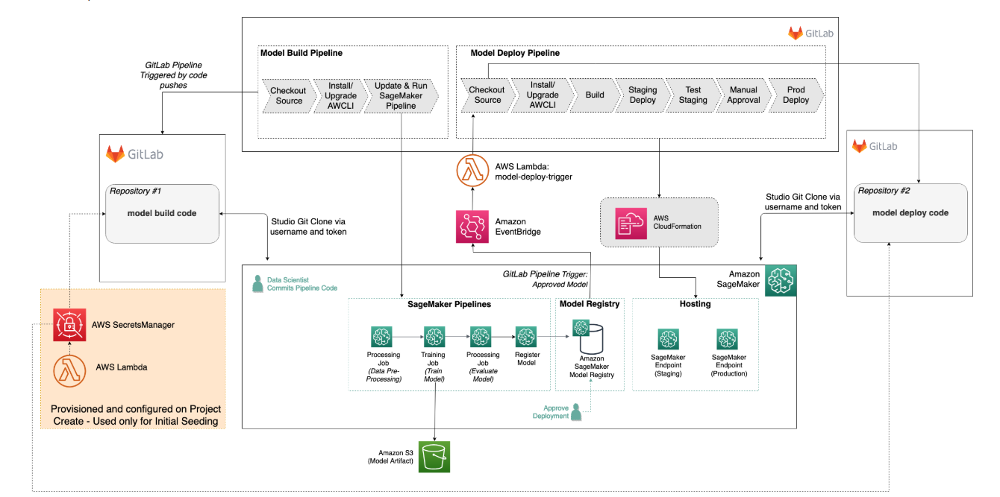

# 🚀 Custom MLOps Template for SageMaker

## 📖 Introduction  
This **MLOps template** is designed to set up a **SageMaker Project** for model training and deployment using **GitLab** for version control and **GitLab Pipelines** for CI/CD automation. It provides a flexible framework for customizing build and deployment pipelines to fit specific machine learning applications.

## 🔗 Reference  
This template is inspired by Amazon Web Services’ official repository:  
🔗 [AWS SageMaker Custom Project Templates](https://github.com/aws-samples/sagemaker-custom-project-templates.git).  

Modifications have been made to **build and deploy pipelines** to align with our specific **medical imaging** use case.

### 📷 Template Architecture  
The following diagram illustrates the architecture of this MLOps template:

 

## 🛠️ Setup Guide  
For detailed instructions on:  
- **Adding the template to SageMaker**  
- **Creating the initial Service Catalog, Product, and Post Product Setup**  
- **Deploying the Project inside SageMaker Studio**  
- **Post Project Deployment steps**  
- **Model Deployment process**  

Please refer to the **AWS GitHub repository** linked above.

## 💡 Application in Healthcare  
These **CI/CD pipelines** automate **model training and deployment** for **medical applications**, specifically **chest X-ray disease detection**.  
🚫 **Training code and dataset details are not disclosed as this is a private project.**  

## 🐳 Docker & Pipeline Execution  
Depending on your specific **machine learning use case**, you may need to create **custom Docker images** to install required dependencies for instances running different steps in the **pipeline**.  
🔍 Check **`pipeline.py`** for details on how `image_uri` is utilized.

---
